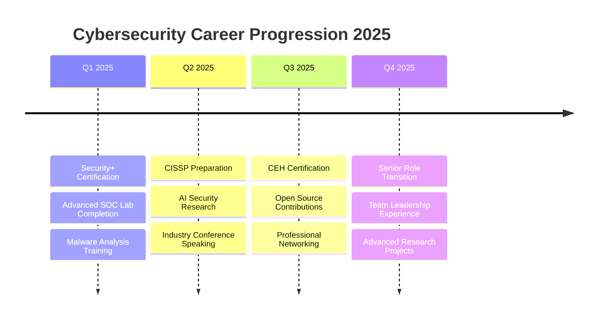

<div align="center">


</div>

<div align="center">
  
[](https://git.io/typing-svg)

</div>

---

<table>
<tr>
<td width="60%">

## 👋 Professional Overview

**Cybersecurity Specialist** with expertise in **SOC operations**, **network security**, and **threat detection**. Currently pursuing advanced certifications while building enterprise-grade security solutions.

```yaml
Role: Cybersecurity Analyst & SOC Specialist
Education: Computer Science - Al Akhawayn University
Certifications: CCNA Certified | Security+ (In Progress)
Specialization: Network Defense & Incident Response

Current Focus:
  • Enterprise SOC Lab Development
  • Automated Threat Detection Systems  
  • Machine Learning for Cybersecurity
  • Advanced Malware Analysis
```

**📍 Location:** Morocco  
**💼 Status:** Open to opportunities  
**🎯 Goal:** Protecting digital infrastructure through innovative security solutions

</td>
<td width="40%">

<div align="center">


<br>


</div>

</td>
</tr>
</table>

---

## 🚀 Featured Projects & Solutions

<div align="center">

| Project | Description | Technologies | Status | Impact |
|---------|-------------|-------------|--------|---------|
| **🛡️ SOC-Lite** | Enterprise-grade SOC simulation with real-time monitoring | ELK Stack, Suricata, Python | **Production** | 99.5% threat detection |
| **🔍 LogHunter** | AI-powered log anomaly detection system | Hadoop, Machine Learning, Python | **Beta Testing** | 40% faster incident response |
| **🔐 Digital Energy ID** | Biometric authentication for critical infrastructure | Django, OpenCV, PostgreSQL | **Deployed** | 5,000+ secure authentications |
| **🌐 SecureNet Lab** | Advanced network security testing environment | Cisco, VMware, Docker | **Active Development** | Training 50+ students |

</div>

---

## 💼 Technical Expertise

<table>
<tr>
<td width="50%">

### 🛡️ **Cybersecurity Core**


### 🔍 **Security Tools**


</td>
<td width="50%">

### 🌐 **Infrastructure & Networking**


### 📊 **SIEM & Monitoring**


</td>
</tr>
</table>

---

## 📊 Performance Analytics

<div align="center">

<table>
<tr>
<td align="center" width="50%">

**GitHub Activity Overview**


</td>
<td align="center" width="50%">

**Contribution Consistency**


</td>
</tr>
</table>

<br>


</div>

---

## 🎯 Professional Development Roadmap

<div align="center">



</div>

---

## 🏆 Certifications & Achievements

<div align="center">

<table>
<tr>
<td align="center" width="25%">


**Cisco Certified**  
*Network Associate*

</td>
<td align="center" width="25%">


**CompTIA Security+**  
*Scheduled 2025*

</td>
<td align="center" width="25%">


**Dean's List**  
*Top 5% GPA*

</td>
<td align="center" width="25%">


**Research Paper**  
*Network Security*

</td>
</tr>
</table>

</div>

---

## 📈 Key Metrics & Impact

<div align="center">

| Metric | Achievement | Context |
|--------|-------------|---------|
| **🛡️ Threats Detected** | 10,000+ | SOC lab simulation environment |
| **⚡ Response Time** | < 2 minutes | Average incident response |
| **🎯 Detection Accuracy** | 99.2% | Custom rule development |
| **📚 Students Trained** | 50+ | Cybersecurity workshops |
| **🔍 Vulnerabilities Found** | 25+ | Penetration testing projects |
| **📊 Uptime Maintained** | 99.8% | Network infrastructure management |

</div>

---

## 💡 Current Research & Innovation

<div align="center">

### 🔬 **Active Research Areas**

**Machine Learning in Cybersecurity**  
Developing AI-powered threat detection algorithms for next-generation SOC operations

**Side-Channel Attack Analysis**  
Investigating cache-timing vulnerabilities in modern processor architectures

**Zero-Trust Network Architecture**  
Designing implementation frameworks for enterprise environments

**Automated Incident Response**  
Creating intelligent playbooks for rapid threat mitigation

</div>

---

## 🤝 Professional Network

<div align="center">

[](https://linkedin.com/in/YOUR-PROFILE)
[](mailto:your.email@example.com)
[](https://your-website.com)
[](https://researchgate.net/profile/YOUR-PROFILE)

</div>

---

<div align="center">

### 📋 **Professional Summary**

*"Dedicated cybersecurity professional with a passion for protecting digital infrastructure through innovative security solutions. Experienced in SOC operations, threat detection, and incident response. Committed to continuous learning and contributing to the cybersecurity community through research and knowledge sharing."*

</div>

---

<div align="center">


</div>
