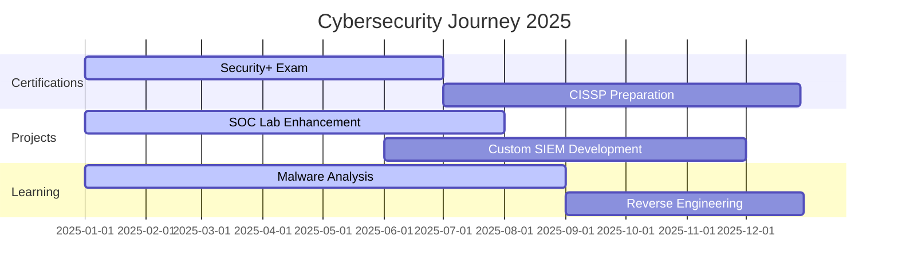

# 🔐 Lamahmdi Cherradi Younes

<div align="center">
  


</div>

<div align="center">
  


</div>

---

<div align="center">

### 💀 『 **In cybersecurity, visibility is key. The logs never lie.** 』 💀

</div>

<br>

## 🎯 **ABOUT ME**


```python
class CyberSecurityExpert:
    def __init__(self):
        self.name = "Lamahmdi Cherradi Younes"
        self.role = "SOC Analyst & Cybersecurity Specialist"
        self.education = "Final-year CS @ Al Akhawayn University"
        self.certifications = ["CCNA", "Security+ (In Progress)"]
        self.current_focus = [
            "Building ELK + Suricata SOC Lab",
            "Hadoop-powered Log Anomaly Detection",
            "Malware Traffic Analysis",
            "Custom Biometric Authentication Systems"
        ]
        
    def get_obsessions(self):
        return {
            "🛡️": "Cyber Defense",
            "🌐": "Network Security", 
            "🔍": "SOC Operations",
            "⚡": "Threat Hunting",
            "🧠": "Incident Response"
        }
```

---

## 🚀 **CURRENT PROJECTS**

<div align="center">

| 🧪 **Project** | 💡 **Description** | 🔧 **Tech Stack** | 🌟 **Status** |
|:-------------:|:------------------:|:-----------------:|:-------------:|
| `SOC-Lite` | Full SOC simulation with real-time alerting |    | 🔥 **Active** |
| `LogHunter` | ML-powered anomaly detection engine |   | ⚡ **Beta** |
| `Digital Energy ID` | Biometric auth for energy subsidies |   | ✅ **Deployed** |
| `CIN-Auth` | OCR + Face recognition system |   | 🔧 **Testing** |

</div>

---

## ⚡ **SKILLS & ARSENAL**

<div align="center">

### 🔥 **Programming & Scripting**


### 🛡️ **Cybersecurity Tools**


### 🌐 **Networking & Infrastructure**


### 📊 **SIEM & Monitoring**


</div>

---

## 📊 **GITHUB STATISTICS**

<div align="center">
  


</div>

<div align="center">
  


</div>

<div align="center">


</div>

---

## 🏆 **ACHIEVEMENTS & CERTIFICATIONS**

<div align="center">


</div>

---

## 🎯 **ROADMAP & GOALS**



---

## 💻 **LATEST ACTIVITY**

<div align="center">

<!--START_SECTION:activity-->
<!--END_SECTION:activity-->

</div>

---

## 🔗 **CONNECT WITH ME**

<div align="center">

[](https://linkedin.com/in/YOUR-PROFILE)
[](https://twitter.com/YOUR-HANDLE)
[](mailto:your.email@example.com)
[](https://your-website.com)

</div>

---

<div align="center">

### 💀 **"Attackers automate. So should defenders."** 💀
### 🔐 **Let's secure the web, one log at a time.** 🔐


</div>

---

<div align="center">
  


</div>
