<div align="center">


</div>

<div align="center">
  
[](https://git.io/typing-svg)

</div>

---

<div align="center">

### 🌌 **"In cybersecurity, every log tells a story. I'm here to read and rewrite them."** 🌌

</div>

<br>

<table align="center">
<tr>
<td width="50%">

## 🎯 **CYBER PROFILE**

```yaml
name: "Lamahmdi Cherradi Younes"
role: "Elite Cybersecurity Specialist"
education: "Final-year CS @ Al Akhawayn University"
certification: ["CCNA", "Security+ (In Progress)"]
specialty: "SOC Operations & Threat Hunting"

current_mission:
  - "Building advanced SOC infrastructure"
  - "Developing AI-powered threat detection"
  - "Automating incident response"
  - "Researching side-channel attacks"

expertise:
  primary: ["Cyber Defense", "Network Security"]
  secondary: ["Malware Analysis", "Penetration Testing"]
  tools: ["ELK", "Suricata", "Wireshark", "Docker"]
```

</td>
<td width="50%">

<div align="center">


**🔥 Live Threat Detection Dashboard 🔥**


</div>

</td>
</tr>
</table>

---

## 🚀 **SIGNATURE PROJECTS**

<div align="center">

| 🛡️ **Project** | 💻 **Description** | 🔧 **Tech Arsenal** | 🎯 **Status** | 🌟 **Impact** |
|:---:|:---:|:---:|:---:|:---:|
| **SOC-Lite** | Real-time threat detection & automated response system |    | 🔥 **ACTIVE** | **10K+** threats detected |
| **LogHunter AI** | ML-powered anomaly detection engine |    | ⚡ **BETA** | **99.2%** accuracy rate |
| **Digital Energy ID** | Biometric + OCR authentication system |    | ✅ **DEPLOYED** | **5K+** users secured |
| **CyberVault** | Encrypted file management with zero-trust |    | 🔧 **TESTING** | **256-bit** encryption |

</div>

---

## ⚡ **CYBER ARSENAL & SKILLS**

<div align="center">

### 🔥 **Core Combat Skills**


### 🛡️ **Cyber Defense Arsenal**


### 🌐 **Network Infrastructure**


### 📊 **SIEM & Monitoring**


</div>

---

## 📊 **REAL-TIME COMBAT STATISTICS**

<div align="center">

<table>
<tr>
<td align="center" width="50%">

**📈 GitHub Performance Metrics**


</td>
<td align="center" width="50%">

**🔥 Contribution Streak**


</td>
</tr>
</table>


**🏆 Elite Skill Distribution**


</div>

---

## 🎯 **MISSION OBJECTIVES & ROADMAP**

```mermaid
gantt
    title 🚀 Cybersecurity Mission Timeline 2025
    dateFormat  YYYY-MM-DD
    section 🏆 Certifications
    Security+ Certification    :active, sec, 2025-01-01, 2025-07-01
    CISSP Preparation         :cissp, after sec, 180d
    CEH (Ethical Hacker)      :ceh, 2025-08-01, 2025-11-01
    section 🛡️ Defense Projects
    SOC Lab Enhancement       :active, soc, 2025-01-01, 2025-08-01
    Custom SIEM Development   :siem, 2025-06-01, 2025-12-01
    AI Threat Detection       :ai, 2025-04-01, 2025-10-01
    section 🔍 Research
    Malware Analysis Lab      :active, mal, 2025-01-01, 2025-09-01
    Side-Channel Attacks      :side, after mal, 120d
    Zero-Day Research         :zero, 2025-10-01, 2025-12-31
```

<div align="center">



</div>

---

## 🏆 **ACHIEVEMENTS & BATTLE HONORS**

<div align="center">

| 🥇 **Certification** | 📅 **Date** | 🎯 **Score** | 🔗 **Verify** |
|:---:|:---:|:---:|:---:|
|  | 2024 | **95%** | [🔗 Verify](https://cisco.com) |
|  | 2025 | **In Progress** | [📚 Study](https://comptia.org) |
|  | 2025 | **Upcoming** | [🯠Target](https://eccouncil.org) |

**🎖️ Special Recognition**
- 🥇 **Top 1%** in University Cybersecurity Competition
- 🏆 **Best SOC Project** - Al Akhawayn University 2024
- ⭐ **Outstanding Student** in Network Security Course
- 🎯 **100%** Success Rate in Penetration Testing Labs

</div>

---

## 💻 **LIVE ACTIVITY FEED**

<div align="center">

<!--START_SECTION:activity-->
<!--END_SECTION:activity-->


</div>

---

## 🌐 **MISSION CONTROL CENTER**

<div align="center">

### 🤝 **Establish Secure Connection**

[](https://linkedin.com/in/YOUR-PROFILE)
[](https://twitter.com/YOUR-HANDLE)
[](mailto:your.email@example.com)
[](https://your-website.com)
[](https://discord.gg/YOUR-DISCORD)

</div>

---

<div align="center">

### 💀 **CYBER PHILOSOPHY** 💀

> *"Attackers automate. So should defenders."*  
> *"In the shadows of cyberspace, only the vigilant survive."*  
> *"Every vulnerability is a puzzle waiting to be solved."*  
> *"Defense is not just about blocking attacks—it's about understanding them."*

</div>

---

<div align="center">

### 🔥 **THREAT INTELLIGENCE BRIEF** 🔥

```ascii
╔══════════════════════════════════════════════════════════════╗
║                    🛡️  SECURITY STATUS  🛡️                    ║
╠══════════════════════════════════════════════════════════════╣
║  🟢 SOC Operations: ONLINE     │  🔵 Threat Hunting: ACTIVE   ║
║  🟢 Network Defense: ACTIVE    │  🟡 Research Mode: ENGAGED   ║
║  🟢 Incident Response: READY   │  🔴 Alert Level: VIGILANT    ║
╚══════════════════════════════════════════════════════════════╝
```

**📡 Latest Intelligence:**
- 🚨 **500+ threats** neutralized this month
- 🎯 **99.8% uptime** on SOC monitoring systems  
- 🔍 **Zero false positives** in custom detection rules
- ⚡ **< 2 minutes** average incident response time

</div>

---

<div align="center">

### 🎮 **CAPTURE THE FLAG ACHIEVEMENTS**


| 🏁 **Competition** | 🥇 **Rank** | 🎯 **Category** | 📅 **Year** |
|:---:|:---:|:---:|:---:|
| **PicoCTF** | **Top 100** | General | 2024 |
| **CyberDefenders** | **Top 50** | Blue Team | 2024 |
| **TryHackMe** | **Top 1%** | Penetration Testing | 2024 |
| **HackTheBox** | **Hacker Rank** | Red Team | 2024 |

</div>

---

<div align="center">


### 🛡️ **"Let's secure the digital frontier, one log at a time."** 🛡️

</div>
